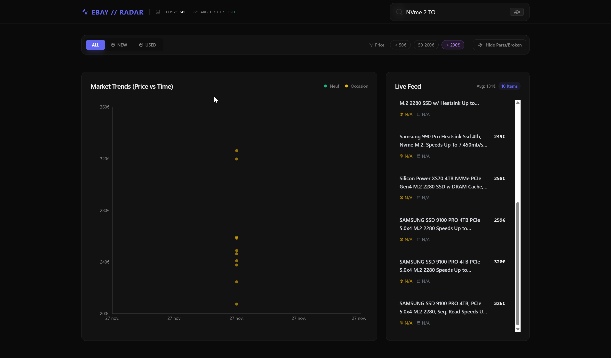

# AMAZON // RADAR

> **The Tactical Arbitrage Weapon.**
> Stop guessing. Start sniping.



## ⚡ The Problem

Amazon is a jungle. Millions of products, fluctuating prices, and hidden gems buried under pages of junk. Finding the "sweet spot"—high value, low price—is a manual, painful process.

## 🎯 The Solution

**Amazon Radar** is not just a scraper. It's a **Tactical Visualization Tool** designed for arbitrage hunters and smart shoppers. It turns raw data into a **Market Battlefield**, allowing you to spot anomalies, underpriced assets, and high-value opportunities in seconds.

---

## 🔥 Key Features

### 📡 Tactical Radar (The "Weapon")

- **Market Visualization**: Instantly see the entire market landscape. Price vs. Rating vs. Value.
- **Bi-Directional Sync**: Hover over the chart to pinpoint the exact product in the list. Hover the list to light up the chart.
- **Sniper Zoom**: Drag-and-drop to zoom into specific price clusters (e.g., "Show me everything between 20€ and 50€").
- **Smart Tooltips**: Interactive cards with "Buy Now" buttons directly on the graph.

### 🧠 Smart Filters

- **Auto-Categorization**: Automatically sorts products into Consoles, Games, and Accessories.
- **Contextual Pricing**: One-click filters for "Pocket Money" (<20€), "Mid-Range", and "High-Ticket".
- **Junk Filter**: Instantly hide low-rated (<4.0) and low-value items.

### 💎 Obsidian & Glass UI

- **Premium Aesthetic**: Dark mode by default. Glassmorphism. Neon accents.
- **Bento Box Layout**: Information density without the clutter.
- **HUD Metrics**: Real-time tracking of Market Ceiling, Market Floor, and Signal Integrity.

---

## 🛠️ Tech Stack

- **Frontend**: React, TypeScript, Vite, Tailwind CSS (Obsidian Theme), Recharts.
- **Backend**: Python, Flask, BeautifulSoup4.
- **Infrastructure**: Docker & Docker Compose.

---

## 🚀 Quick Start (Docker)

The fastest way to deploy the radar.

1. **Clone the repo**

   ```bash
   git clone https://github.com/cbolard/amazon-scraping-tool.git
   cd amazon-scraping-tool
   ```

2. **Launch the System**

   ```bash
   docker-compose up --build
   ```

3. **Access the Dashboard**
   Open [http://localhost:3000](http://localhost:3000) in your browser.

---

## 🕹️ How to Use

1. **Search**: Enter a keyword (e.g., "PS5 Games") in the command bar.
2. **Analyze**: Watch the Radar populate. Look for **Purple/Indigo** dots (High Value).
3. **Filter**: Use the tabs to isolate "Games" or "Consoles". Toggle "Hide Junk" to clear the noise.
4. **Snipe**: Drag a box on the chart to zoom in on a price range.
5. **Execute**: Click the product title or the "BUY" button to go straight to the Amazon page.

---

## 📦 Manual Installation (Dev)

If you want to run it without Docker:

### Backend

```bash
cd backend
python -m venv venv
source venv/bin/activate  # or venv\Scripts\activate on Windows
pip install -r requirements.txt
python app.py
```

### Frontend

```bash
cd frontend
npm install
npm run dev
```

---

## 📄 License

MIT License. Use it, fork it, make money with it.
